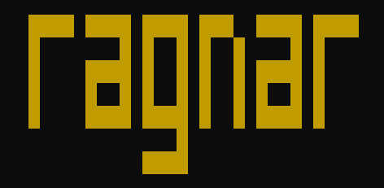

***Ragnar*** is a programming language made for fun, and carefully vibecoded using Antigravity. 

- inspired by **Rebol**. Many core features from Rebol are implemented, including the object system and the powerfull parse function.
- hosted in .NET with decent interop. 
- made to be useful from the command line, and have a REPL. 
- has a simple actor model implementation inspired by **Erlang**.
- is functional
    - *lexically scoped*, and all functions are closures (unlike Rebol). 
    - has tail-call optimized recursion (TCO).
    - has functional composition inspired by **F#**.
    - has partial application inspired by **Clojure**.

Ragnar homepage: [tormaroe.github.io/ragnar](https://tormaroe.github.io/ragnar)

