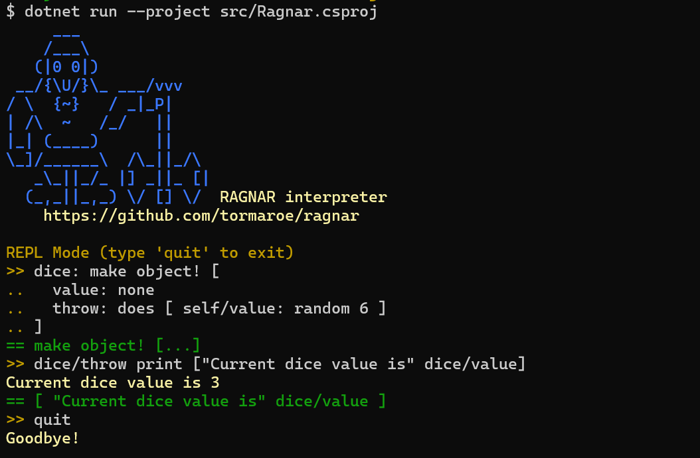

***Ragnar*** is a scripting language inspired by Rebol. It's hosted in and have decent interop with .NET. It is made to be useful from the command line, and have a REPL. Many core features from Rebol are implemented, including the object system. Unlike Rebol, Ragnar has lexical scoping and tail call optimization.

### Status

Hobby project, basically just started. Vibecoding with Gemini CLI.

## REPL demo

