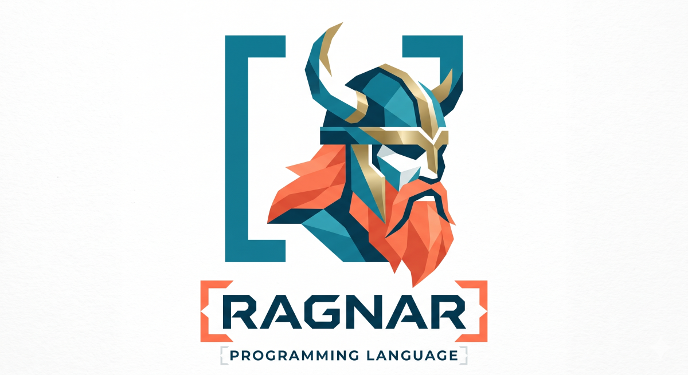

***Ragnar*** is a programming language made for fun, and carefully vibecoded using Gemini CLI. It:
- is inspired by **Rebol**. Many core features from Rebol are implemented, including the object system.
- is *lexically scoped*, all functions are closures (unlike Rebol). 
- is hosted in .NET with decent interop. 
- is made to be useful from the command line, and have a REPL. 
- has tail call optimized recursion (TCO).
- has functional composition inspired by **F#**.
- has partial application inspired by **Clojure**.
- has a simple actor model implementation inspired by **Erlang**.

[](https://github.com/tormaroe/ragnar/actions/workflows/dotnet.yml)

## Features

### REPL and reflection

TODO

### Configuration

Ragnar will look for a .ragnar.r file in your HOME directory. Here is how that can be used to configure your REPL:

```rebol 
>> config-path: join home rc-file-name
== %C:\Users\bob/.ragnar.r
>> write config-path mold/only [
..   me: "Bob"
..   print ["Hello" me "it is now" now/time]
..   system/console/prompt: "?? "
.. ]
```

Now when you restart your REPL is will say hello, and the prompt is modified:

```rebol 
Hello Bob it is now 10:53:01 AM
REPL Mode (type 'quit' to exit)
?? me
== "Bob"
??
``` 

You can also reload your configuration file by executing:

```rebol 
do join home rc-file-name
```


### Core Ragnar features 

TODO

### .NET interop

TODO

### Object support

TODO

### Tail call optimization

TODO

### Actor model

An actor example inspired by Joe Armstrong of Erlang fame:

```rebol 
start-area-server: does [
    spawn [  ; Starts a new actor process (.NET task)
        forever [
            msg: receive  ; Blocks and waits to receive on a channel
            client: first msg  ; The sender, needs a reply
            shape: second msg
            switch/default first shape [
                rectangle [
                    tell client reform [ "area of rectangle is" (shape/2 * shape/3) ]
                ]
                circle [
                    tell client reform [ "area of circle is" (3.14159 * (shape/2 * shape/2)) ]
                ]
            ] [
                tell client reform [ "i don't know what the area of a" shape/1 "is." ] 
            ]
        ]
    ]
]

server: start-area-server
print ["Response:" rpc server [rectangle 5 10]]
print ["Response:" rpc server [circle 5]]
print ["Response:" rpc server [triangle 5 10]]
kill server
```

Functions: `kill`, `receive`, `rpc`, `tell`

### Functional programming

TODO: Example using partial application, composition, and closure
